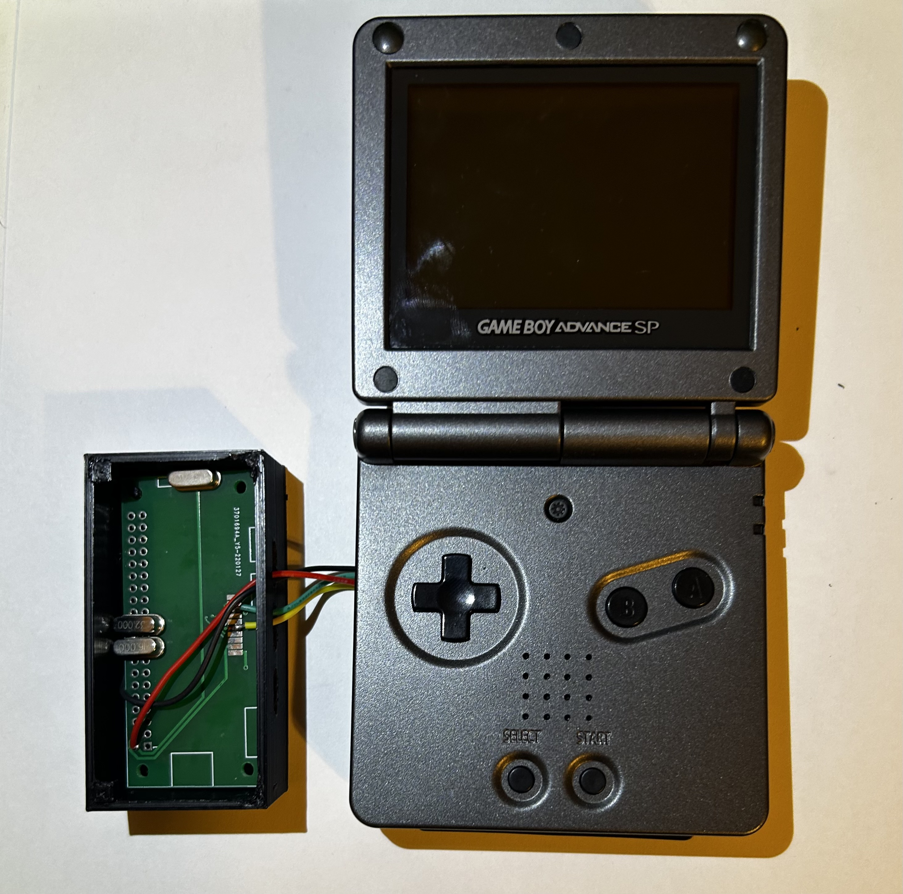
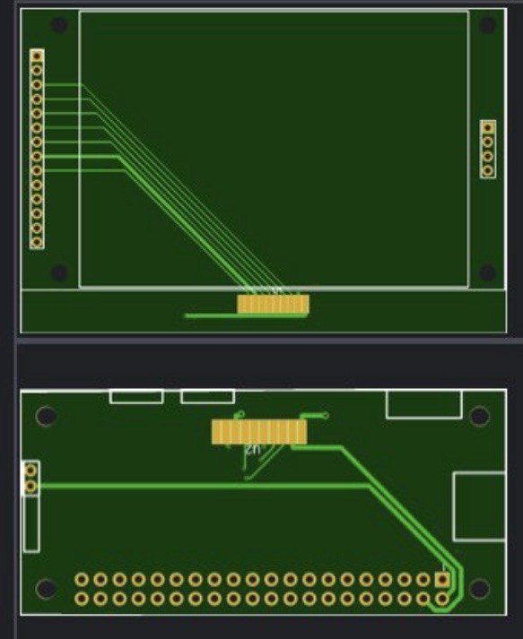

# GBA-Overclock Tool

<!-- 2-Column Side-by-Side Table -->
<table align="center">
  <tr>
    <td align="center" width="50%">
      
       <b>Custom PCB Interface</b>
    </td>
    <td align="center" width="50%">
      
       <b>PCB Line Routing</b>
    </td>
  </tr>
</table>

Non-Destructive hardware interface designed to intercept and manipulate the internal clock speed of the Game Boy Advance (GBA), for dynamic speed control or software testing purposes.

The overclock tool works by replacing and overriding the default system clock signal on the Game Boy Advance using a custom breakout board. By intercepting the stock crystal oscillator circuit (natively running at $1.678 \times 10^7 \text{ Hz}$), this board then connects the signal to its internal array of oscillators to enable variable runtime execution speeds, making it ideal for testing homebrew software stability under non-standard clock cycles and analyzing system behavior under stress.

To put it simply, this project attempts to port the variable speed option from emulators onto real hardware, while prioritizing hardware integrity.
